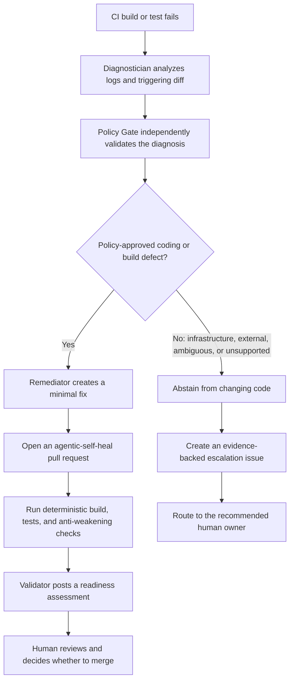

# project-self-healing-ci

This repository demonstrates a **GitHub-native self-healing CI pipeline** with three scenarios:

1. dependency remediation (existing scenario)
2. coverage-gap remediation (new)
3. performance-budget remediation (new)

All automated remediation remains PR-based, policy-gated, and human-reviewed.

## End-to-end architecture

Deterministic jobs produce machine-readable evidence first, then agentic workflows consume that evidence:

1. **CI** (`.github/workflows/ci.yml`) builds, tests, enforces coverage + performance budgets, and emits structured artifacts.
2. **Sample Diagnose** (`.github/workflows/self-heal.md`) inspects failed-run evidence + diff and creates one diagnosis handoff.
3. **Sample Policy Gate** (`.github/workflows/self-heal-policy.md`) validates provenance and decides `allow_remediation` or `abstain_and_escalate`.
4. Exactly one branch runs:
   - **Sample Remediate** opens a minimal healing PR with label `agentic-self-heal`, or
   - **Sample Escalate** opens an escalation issue (no code changes).
5. **Healing PR Validation** (`.github/workflows/healing-pr-validation.yml`) reruns deterministic checks and anti-weakening policy checks.
6. **Sample Healing Review** (`.github/workflows/self-heal-validate.md`) posts readiness for human review; it never merges.

See `docs/architecture.md` for sequence details.

## End-to-end workflow



A policy-approved coding or build defect can produce a validated healing pull request, but no agent merges it. Infrastructure, external-system, ambiguous, and unsupported failures fail closed: the system creates an escalation issue and makes no code change.

## Customer-shaped simulation

The fixtures and agent language mirror relevant Sample concepts:

- core, backend, frontend, agentic, and packaging modules
- Conan/JFrog-style dependency resolution
- build, regression, release-tree, and Coverity-shaped stages
- LSF, NFS, runner, and external-system failure categories

The demo does not connect to live sample-db, LSF, NFS, Coverity, JFrog, JIRA, customer databases, or customer credentials.

## Deterministic vs contextual responsibilities

- **Deterministic**: build/test execution, coverage computation, performance measurement, gate evaluation, handoff schema validation, anti-weakening checks, protected-config checks.
- **Contextual**: diagnosis reasoning, policy interpretation with evidence, minimal remediation proposal, escalation narrative.

## Quality-gate configuration

Central thresholds/budgets live in `config/quality-gates.json`:

- `coverage.overall_line_coverage_min`
- `coverage.changed_line_coverage_min`
- `performance.runtime_median_ms_max`
- `performance.cpu_time_median_ms_max`
- `performance.peak_rss_kb_max`

These values are treated as **CI policy gates**, not universal production SLOs.

## Scenario matrix

| Scenario | Trigger | Deterministic check | Evidence generated | Agent action | Allowed modifications | Forbidden modifications | Validation | Human approval point |
|---|---|---|---|---|---|---|---|---|
| Dependency failure | Invalid Conan reference | Conan install fails | `build/logs/conan-install.log`, `build/classification/failure-classification.json` | Diagnose → Policy allow → Remediate PR | bounded dependency correction + regression test updates | secrets/permissions/workflow broadening, test weakening | CI + Healing PR Validation | Healing PR review |
| Insufficient coverage | Changed/new logic without enough tests | `scripts/evaluate_coverage.py` | `build/coverage/coverage.json`, `build/coverage/coverage-gate.json`, coverage summary | Diagnose → Policy allow → Remediate PR (test additions first) | meaningful tests, fixtures, minimal testability fixes | lowering coverage thresholds, empty/skipped tests, unrelated edits | same CI gates rerun on healing PR | Healing PR review |
| Performance budget exceeded | Runtime/CPU/memory regression in deterministic workload | `scripts/evaluate_performance.py` | `build/performance/performance-results.json`, `build/performance/performance-gate.json` | Diagnose → Policy allow/abstain based on scope | localized safe optimization, deterministic perf-test refinements | raising budgets, disabling benchmark/tests, correctness regression | same CI gates rerun on healing PR | Healing PR review |

## Failure classifications used by routing

- `dependency_failure`
- `insufficient_coverage`
- `runtime_budget_exceeded`
- `memory_budget_exceeded`
- `cpu_budget_exceeded`
- `functional_test_failure`
- `unsupported_or_unsafe_remediation`
- `runner_or_external_system`
- `unknown`

`scripts/classify_ci_failure.py` emits `build/classification/failure-classification.json` for diagnosis routing.

## Demo application extensions

- **Coverage demo component**: `src/risk_classifier.cpp` + `tests/risk_classifier_test.cpp`
  - multi-branch risk classification logic
  - deterministic tests with positive/negative/boundary behavior
- **Performance demo component**: `src/performance_demo.cpp` + `tests/performance_budget_test.cpp`
  - includes slow and optimized implementations
  - benchmark probe uses warm-up + multiple samples and reports median runtime/CPU + peak RSS

## Performance measurement limitations

- Runtime metric: wall-clock median across deterministic samples.
- CPU metric: process CPU-time median (`std::clock`) across deterministic samples.
- Memory metric: Linux `ru_maxrss` process peak resident memory.

On shared GitHub-hosted runners, residual noise is expected; this demo minimizes false positives through bounded workloads, warm-up, and median aggregation.

## Local execution

### Full deterministic path

```bash
make ci
```

### Coverage gate only

```bash
conan profile detect --force
conan install . --output-folder=build --build=missing -s build_type=Debug
cmake -S . -B build -DCMAKE_TOOLCHAIN_FILE=build/conan_toolchain.cmake -DCMAKE_BUILD_TYPE=Debug -DPROJECT_BOOST_ENABLE_COVERAGE=ON
cmake --build build --config Debug
ctest --test-dir build --output-on-failure --no-tests=error --output-junit build/ctest-results.xml
gcovr --root . --object-directory build --filter '^.*/(src|include)/' --json build/coverage/coverage.json --xml-pretty build/coverage/cobertura.xml --txt build/coverage/summary.txt
python3 scripts/evaluate_coverage.py --coverage-json build/coverage/coverage.json --gates-config config/quality-gates.json --report-output build/coverage/coverage-gate.json
```

### Performance gate only

```bash
ctest --test-dir build -R project_boost_performance_budget_probe --output-on-failure
cp build/performance-results.json build/performance/performance-results.json
python3 scripts/evaluate_performance.py --results-json build/performance/performance-results.json --gates-config config/quality-gates.json --report-output build/performance/performance-gate.json
```

### Policy tests

```bash
python3 tests/policy/run_policy_tests.py --output build/policy-test-results.json
```

## GitHub Actions execution and expected outcomes

### Healthy state

1. Open/update PR with no regressions.
2. CI passes build, tests, coverage, performance, and policy checks.
3. `build/classification/failure-classification.json` reports `"classification": "none"`.

### Coverage failure state

1. Add a new branch in `src/risk_classifier.cpp` (or equivalent changed source path) without adding matching tests.
2. Open PR.
3. `evaluate_coverage.py` fails and writes structured reasons in `build/coverage/coverage-gate.json`.
4. Diagnose/Policy/Remediate chain can propose additional tests in a healing PR.

### Performance failure state

1. Replace `CountUniqueCommonTokens` implementation with the slow nested-loop path in `src/performance_demo.cpp`.
2. Open PR.
3. `evaluate_performance.py` fails with metric/budget/observed evidence in `build/performance/performance-gate.json`.
4. Diagnose/Policy/Remediate can propose a minimal optimization in a healing PR.

## Security and governance model

- Least-privilege workflow permissions are preserved.
- No direct pushes to default branch.
- Remediation only via labeled PR (`agentic-self-heal`).
- `Healing PR Validation` blocks:
  - deleted tests
  - weakened assertions/skips
  - protected workflow/security config edits
  - quality-gate threshold relaxation (`tests/policy/check_quality_gate_diff.py`)
- Agent cannot approve/merge its own PR.
- Recursive loops are constrained by policy routing and explicit artifact flow.
- Full evidence trail is persisted via CI artifacts and policy handoff artifacts.

## Existing dependency scenario (preserved)

The existing dependency self-healing scenario is unchanged in behavior and remains demonstrable through invalid Conan version failure, diagnosis, policy allow, minimal remediation PR, deterministic validation, and human decision.

## Workflow authoring/compilation

After changing any `.github/workflows/*.md` agentic workflow source:

```bash
gh aw validate
gh aw compile
```

Commit both Markdown and generated `.lock.yml` files.

## Cleanup/reset

```bash
rm -rf build
git restore .
```

Use `git restore` selectively if you only need to reset specific files.
