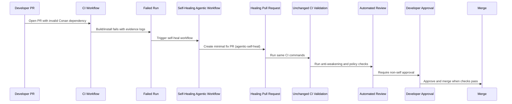

# Architecture

## Deterministic vs agentic behavior

- Deterministic GitHub Actions:
  - `.github/workflows/ci.yml`
  - `.github/workflows/healing-pr-validation.yml`
- Contextual agent reasoning:
  - `.github/workflows/self-heal.md` (compiled with `gh-aw`)
