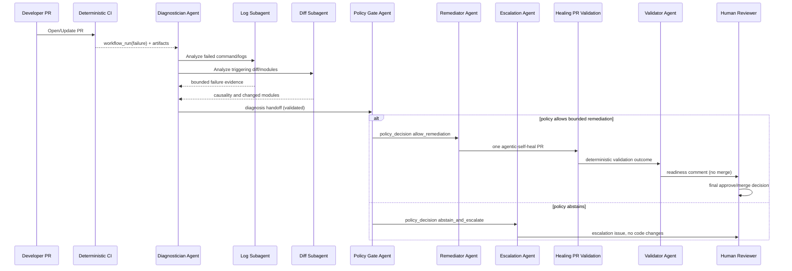

# Architecture

```mermaid
sequenceDiagram
    participant Dev as Developer PR
    participant CI as Deterministic CI
    participant D as Diagnostician Agent
    participant LS as Log Subagent
    participant DS as Diff Subagent
    participant P as Policy Gate Agent
    participant R as Remediator Agent
    participant E as Escalation Agent
    participant V as Healing PR Validation
    participant A as Validator Agent
    participant H as Human Reviewer

    Dev->>CI: Open/Update PR
    CI-->>D: workflow_run(failure) + artifacts
    D->>LS: Analyze failed command/logs
    D->>DS: Analyze triggering diff/modules
    LS-->>D: bounded failure evidence
    DS-->>D: causality and changed modules
    D->>P: diagnosis handoff (validated)

    alt policy allows bounded remediation
      P->>R: policy_decision allow_remediation
      R->>V: one agentic-self-heal PR
      V->>A: deterministic validation outcome
      A->>H: readiness comment (no merge)
      H->>H: final approve/merge decision
    else policy abstains
      P->>E: policy_decision abstain_and_escalate
      E->>H: escalation issue, no code changes
    end
```

## Reused components

- Existing `self-heal*` workflow chain and handoff model.
- Existing custom agents (`sample-diagnostician`, `sample-policy-gate`, `sample-remediator`, `sample-escalation`, `sample-validator`).
- Existing deterministic policy harness (`tests/policy/` and `docs/handoff-contracts.json`).
- Existing healing PR validation as the mandatory pre-merge quality gate.

## New deterministic quality surfaces

1. **Coverage evidence + gate**
   - `gcovr` JSON/XML/TXT output.
   - `scripts/evaluate_coverage.py` computes overall coverage and changed-line coverage when measurable.
   - Structured result: `build/coverage/coverage-gate.json`.

2. **Performance evidence + gate**
   - deterministic probe executable (`project_boost_performance_budget_probe`).
   - warm-up + multi-sample median metrics for runtime and CPU, plus peak RSS.
   - Structured result: `build/performance/performance-gate.json`.

3. **Failure classification**
   - `scripts/classify_ci_failure.py` emits one machine-readable routing artifact:
     `build/classification/failure-classification.json`.

## Handoff and policy boundaries

- Handoff schema remains versioned and validated.
- Policy still fails closed on malformed/ambiguous provenance.
- New classifications for coverage and performance are explicitly enumerated.
- Threshold relaxation (coverage down / performance budgets up) is blocked in healing PR validation.

## Security model

- CI and validation remain least-privilege (`contents: read` plus minimal per-job grants).
- Agentic workflows still use declared safe outputs only.
- Remediation remains PR-only (`agentic-self-heal`) with human approval required.
- No direct default-branch pushes, no auto-merge, no branch-protection/secret/permission edits.

## Reliability notes

- Coverage changed-line evaluation is reported as `not_measurable` when instrumentation does not map changed lines; it is never fabricated.
- Performance budgets are CI policy thresholds for repeatable demo governance, not production-wide SLO guarantees.
