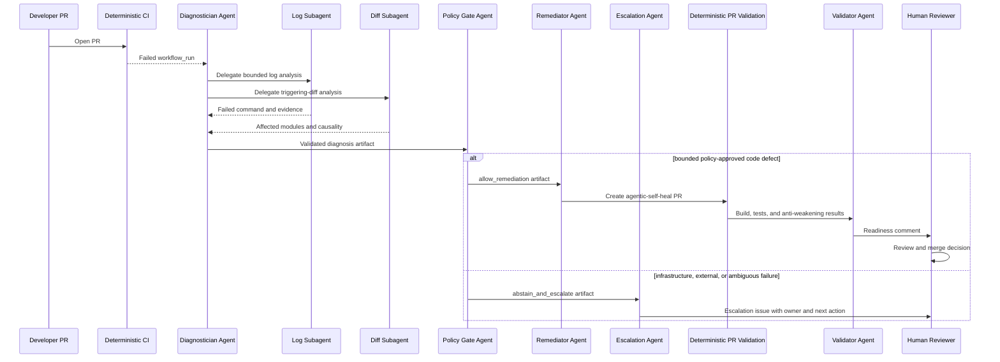

# Architecture

```mermaid
sequenceDiagram
    participant Dev as Developer PR
    participant CI as Deterministic CI
    participant D as Diagnostician Agent
    participant LS as Log Subagent
    participant DS as Diff Subagent
    participant P as Policy Gate Agent
    participant R as Remediator Agent
    participant E as Escalation Agent
    participant V as Deterministic PR Validation
    participant A as Validator Agent
    participant H as Human Reviewer

    Dev->>CI: Open PR
    CI-->>D: Failed workflow_run
    D->>LS: Delegate bounded log analysis
    D->>DS: Delegate triggering-diff analysis
    LS-->>D: Failed command and evidence
    DS-->>D: Affected modules and causality
    D->>P: Validated diagnosis artifact

    alt bounded policy-approved code defect
        P->>R: allow_remediation artifact
        R->>V: Create agentic-self-heal PR
        V->>A: Build, tests, and anti-weakening results
        A->>H: Readiness comment
        H->>H: Review and merge decision
    else infrastructure, external, or ambiguous failure
        P->>E: abstain_and_escalate artifact
        E->>H: Escalation issue with owner and next action
    end
```

## Workflow-level coding agents

Each agentic workflow selects a repository custom-agent profile from `.github/agents/` using the Copilot engine's `agent` option:

| Workflow | Custom agent | Responsibility |
|---|---|---|
| `Sample Diagnose` | `sample-diagnostician` | Evidence collection, classification, and diagnosis |
| `Sample Policy Gate` | `sample-policy-gate` | Independent allow-or-abstain decision |
| `Sample Remediate` | `sample-remediator` | Minimal policy-approved fix and pull request |
| `Sample Escalate` | `sample-escalation` | Evidence-backed non-code escalation |
| `Sample Healing Review` | `sample-validator` | Independent readiness assessment |

## Native subagents

The parent coding agents delegate bounded work to inline Copilot subagents:

- `sample-log-analyst`
- `sample-diff-analyst`
- `sample-provenance-auditor`
- `sample-test-planner`
- `sample-regression-auditor`

The parent remains accountable for the final output and must reconcile subagent findings against cited evidence.

## Deterministic handoffs

Diagnose and Policy Gate publish one `agent-handoff` artifact through a custom safe-output job. Before publication:

1. The safe-output payload is extracted from `GH_AW_AGENT_OUTPUT`.
2. `tests/policy/extract_handoff.py` requires exactly one payload.
3. `tests/policy/healing_rules.py` validates the versioned contract.
4. Diagnosis provenance is compared with the triggering CI event.
5. Later handoffs are compared field-for-field with the artifact from the exact predecessor run.
6. Downstream workflows redownload and validate the artifact before their coding agent starts.

Each artifact carries repository, source run ID and URL, commit SHA, and pull request number when available. Missing, malformed, stale, or mismatched provenance stops the chain.

## Orchestration choice

GitHub events and artifacts coordinate the agents:

- `CI` failure triggers Diagnose.
- Diagnose completion triggers Policy Gate.
- Policy Gate completion triggers both outcome workflows, but deterministic routing allows only the matching agent to execute.
- Healing PR Validation is rooted in the pull-request event, and its completion triggers Healing Review.

This fits within GitHub's `workflow_run` chaining limit and does not require a PAT or GitHub App merely to retrigger label events.

Pull requests created with the default `GITHUB_TOKEN` can leave their workflows pending GitHub approval. Configure the optional `GH_AW_CI_TRIGGER_TOKEN` through an administrator-managed secret for uninterrupted execution, or include the **Approve workflows to run** click in the demo. No coding agent manages that credential.

## Security boundaries

- Agent jobs are read-only.
- Pull requests, issues, comments, and handoff publication use declared safe outputs.
- Remediation cannot run on an abstention decision.
- Escalation has no code-write safe output.
- Validation never approves or merges.
- Branch protection, secrets, credentials, permissions, runners, and customer infrastructure remain outside agent control.
